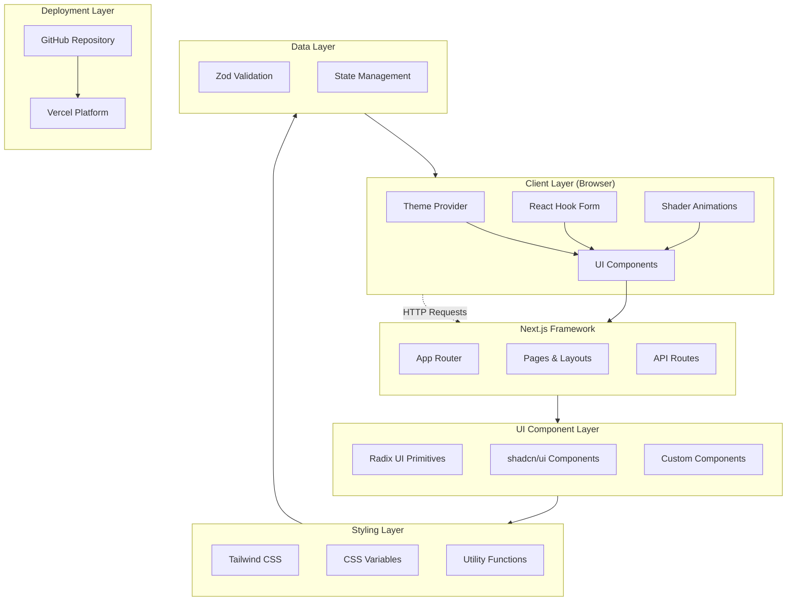

# Agent - Hero Section

_A modern, visually striking hero section component built with Next.js, featuring animated shaders and a polished UI design._

[](https://vercel.com/gileb64375-5584s-projects/v0-agent-hero-section)
[](https://v0.app/chat/projects/sPKoYKzZlUt)
[](https://nextjs.org)
[](https://react.dev)

---

## 📋 Table of Contents

- [Overview](#overview)
- [Features](#features)
- [Tech Stack](#tech-stack)
- [System Architecture](#system-architecture)
- [Getting Started](#getting-started)
- [Configuration](#configuration)
- [Project Stats](#project-stats)
- [Deployment](#deployment)

---

## 🚀 Overview

This project is a modern **Agent Hero Section** built using **Next.js 15** with **React 19**, featuring a visually captivating design with animated shaders, interactive UI components, and a responsive layout. It leverages the **shadcn/ui** component library with **Radix UI** primitives for accessible, high-quality components.

> **Note:** This repository stays in sync with your deployed chats on [v0.app](https://v0.app). Any changes made to your deployed app will be automatically pushed to this repository.

---

## ✨ Features

### 🎨 UI/UX Features
- **Animated Shaders** - Pulsing border shader effect using `@paper-design/shaders-react`
- **Responsive Design** - Fully responsive layout optimized for all screen sizes
- **Dark/Light Mode** - Theme provider supporting system preferences
- **Modern Typography** - Using Geist font family

### 🧩 Component Features
- **Interactive Buttons** - Call-to-action buttons with hover effects
- **Shader Animation** - Custom GLSL shader with pulsing border effect
- **Gradient Effects** - Beautiful gradient backgrounds and text styling
- **Accessibility** - Built with Radix UI primitives for proper ARIA support

### 🔧 Technical Features
- **TypeScript** - Full type safety throughout the codebase
- **Tailwind CSS** - Utility-first CSS framework with custom configuration
- **Code Quality** - ESLint and TypeScript strict mode enabled
- **Zero-Config** - Pre-configured build and development scripts

---

## 🛠 Tech Stack

### Frontend
| Technology | Version | Purpose |
|------------|---------|---------|
| **Next.js** | 15.2.4 | React framework with App Router |
| **React** | 19 | UI library |
| **TypeScript** | 5.x | Type-safe JavaScript |
| **Tailwind CSS** | 3.4.17 | Utility-first CSS framework |

### UI Components & Libraries
| Library | Version | Purpose |
|---------|---------|---------|
| **@radix-ui/** | 1.x | Accessible UI primitives |
| **shadcn/ui** | latest | Component library |
| **lucide-react** | 0.454.0 | Icon library |
| **tailwind-merge** | 2.5.5 | CSS class merging |
| **clsx** | 2.1.1 | Conditional class names |
| **class-variance-authority** | 0.7.1 | Class variant utilities |

### Animation & Shaders
| Library | Version | Purpose |
|---------|---------|---------|
| **@paper-design/shaders-react** | latest | WebGL shader components |

### Forms & Validation
| Library | Version | Purpose |
|---------|---------|---------|
| **react-hook-form** | 7.54.1 | Form handling |
| **@hookform/resolvers** | 3.9.1 | Form validation resolvers |
| **zod** | 3.24.1 | Schema validation |

### Additional Dependencies
| Library | Version | Purpose |
|---------|---------|---------|
| **next-themes** | 0.4.4 | Theme management |
| **sonner** | 1.7.1 | Toast notifications |
| **date-fns** | 4.1.0 | Date utilities |
| **recharts** | 2.15.0 | Chart library |
| **embla-carousel-react** | 8.5.1 | Carousel component |

---

## 🏗 System Architecture



---

## 📦 Getting Started

### Prerequisites

Ensure you have the following installed:

- **Node.js** 18.x or later
- **npm** 9.x or later (or **yarn** / **pnpm**)

### Installation

```bash
# Clone the repository
git clone <repository-url>
cd agent-hero-section

# Install dependencies (use --legacy-peer-deps for React 19 compatibility)
npm install --legacy-peer-deps
```

### Development

```bash
# Start development server
npm run dev

# Build for production
npm run build

# Start production server
npm run start

# Run linting
npm run lint
```

### Development Server

The development server runs on **http://localhost:3000**

```bash
# Default command
npm run dev
```

---

## ⚙️ Configuration

### Tailwind Configuration

The project uses a customized Tailwind CSS setup with:

- **Custom colors** - Extended color palette
- **Animations** - Keyframe animations
- **Responsive breakpoints** - Mobile-first approach

```typescript
// tailwind.config.ts (excerpt)
{
  darkMode: ["class"],
  content: ["./app/**/*.{ts,tsx}", "./components/**/*.{ts,tsx}"],
  theme: {
    extend: {
      colors: {
        border: "hsl(var(--border))",
        background: "hsl(var(--background))",
        foreground: "hsl(var(--foreground))",
      },
    },
  },
  plugins: [require("tailwindcss-animate")],
}
```

### TypeScript Configuration

Strict TypeScript configuration with:

- **Strict mode** enabled
- **ES2020** target
- **Node** module resolution

```json
// tsconfig.json (excerpt)
{
  "compilerOptions": {
    "target": "ES2020",
    "lib": ["dom", "dom.iterable", "esnext"],
    "allowJs": true,
    "strict": true,
    "noEmit": true,
    "esModuleInterop": true,
    "module": "esnext",
    "moduleResolution": "bundler",
    "resolveJsonModule": true,
    "isolatedModules": true,
    "jsx": "preserve",
    "incremental": true
  }
}
```

### PostCSS Configuration

Autoprefixer and Tailwind CSS processing:

```javascript
// postcss.config.mjs
export default {
  plugins: {
    tailwindcss: {},
    autoprefixer: {},
  },
};
```

### Environment Variables

Create a `.env.local` file if needed:

```env
# Optional: Analytics
NEXT_PUBLIC_ANALYTICS_ID=your-analytics-id
```

---

## 📊 Project Stats

| Metric | Value |
|--------|-------|
| **Total Dependencies** | 242 packages |
| **Production Dependencies** | 51 packages |
| **Development Dependencies** | 6 packages |
| **Total Components** | 20+ shadcn/ui components |
| **Lines of Code** | ~500+ (excluding node_modules) |

### Package Breakdown

- **Dependencies:** 51 (production)
- **DevDependencies:** 6
- **Optional Dependencies:** 2

---

## 🚦 Deployment

### Vercel (Recommended)

Your project is automatically deployed on Vercel:

**Live URL:** [https://vercel.com/gileb64375-5584s-projects/v0-agent-hero-section](https://vercel.com/gileb64375-5584s-projects/v0-agent-hero-section)

### Manual Deployment

```bash
# Build the project
npm run build

# Deploy to Vercel
vercel deploy

# Or deploy to other platforms
npm run build
# Upload .next folder to your hosting provider
```

---

## 📁 Project Structure

```
agent-hero-section/
├── app/                      # Next.js App Router
│   ├── layout.tsx           # Root layout with providers
│   ├── page.tsx             # Main page component
│   └── globals.css          # Global styles
├── components/
│   ├── ui/                  # shadcn/ui components
│   │   └── button.tsx       # Button component
│   ├── pulsing-border-shader.tsx  # Shader animation
│   └── theme-provider.tsx   # Theme provider
├── lib/
│   └── utils.ts             # Utility functions (cn, etc.)
├── public/                  # Static assets
├── styles/
│   └── globals.css          # Additional styles
├── package.json             # Dependencies & scripts
├── tailwind.config.ts       # Tailwind configuration
├── tsconfig.json            # TypeScript configuration
├── next.config.ts           # Next.js configuration
└── postcss.config.mjs       # PostCSS configuration
```

---

## 🔐 Security Notes

> **Warning:** The project has 2 security vulnerabilities (1 moderate, 1 critical). Run `npm audit fix` to address them.

---

## 🤝 Contributing

This project is automatically synced with [v0.app](https://v0.app). Direct modifications should be made through the v0 interface or by forking the repository.

---

## 📄 License

This project is private and synced with v0.app deployment.

---

## 🔗 Links

- **Live Demo:** [https://vercel.com/gileb64375-5584s-projects/v0-agent-hero-section](https://vercel.com/gileb64375-5584s-projects/v0-agent-hero-section)
- **v0 Project:** [https://v0.app/chat/projects/sPKoYKzZlUt](https://v0.app/chat/projects/sPKoYKzZlUt)
- **Next.js Docs:** [https://nextjs.org/docs](https://nextjs.org/docs)
- **Tailwind CSS:** [https://tailwindcss.com](https://tailwindcss.com)
- **shadcn/ui:** [https://ui.shadcn.com](https://ui.shadcn.com)
---

## 👤 Author

**Built by Girish Lade** — [ladestack.in](https://ladestack.in)

Part of the [LadeStack](https://ladestack.in) collection of free, open-source projects.
